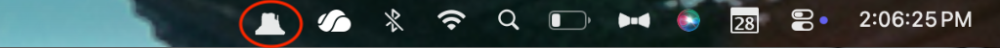
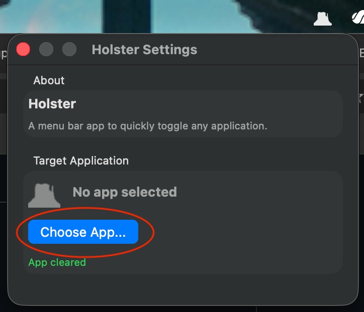
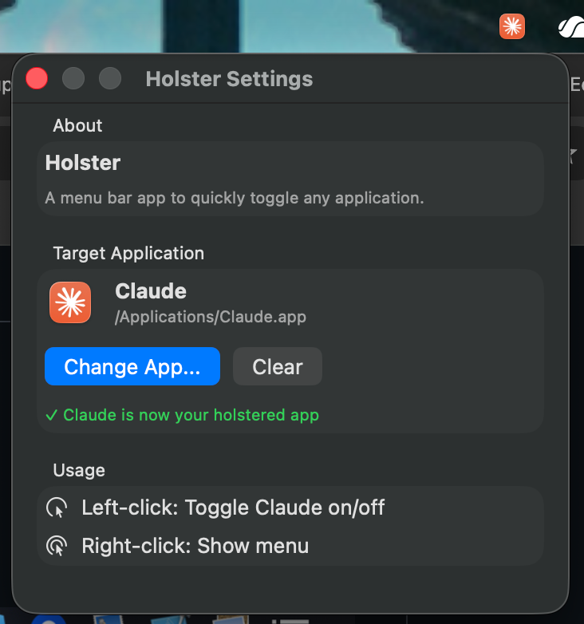
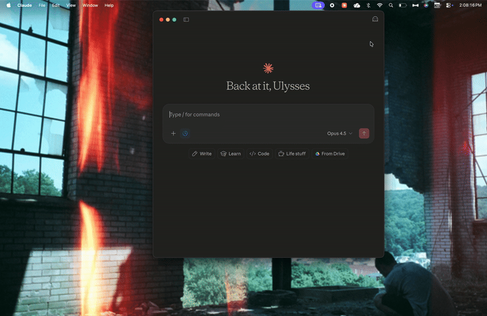

# Holster

A lightweight macOS menu bar app that lets you instantly toggle any application on and off with a single click.

## Quick Download

  

## What It Does

Holster sits quietly in your menu bar displaying the icon of your chosen app. One click shows or hides that app — perfect for apps you frequently toggle like Claude, Spotify, Messages, Slack, or even Adobe tools.

**Think of it as a quick-draw holster for your favorite app.**

## Features

- **One-click toggle** — Left-click to show/hide your holstered app
- **Native app icon** — Menu bar shows the actual icon of your chosen app
- **Lightweight** — Runs as a pure menu bar app (no Dock icon)
- **Simple setup** — Right-click to choose or change your target app
- **Remembers your choice** — Settings persist between launches

## Screenshots

  

  <em>Holster lives in the menu bar (circled in red)</em>

  

  <em>Settings panel with no app selected</em>

  

  <em>Settings panel with Claude as the holstered app — menu bar shows the Claude icon</em>

  

  <em>Holster in action — one click shows/hides Claude</em>

## Usage

| Action | Result |
|--------|--------|
| **Left-click** | Toggle the holstered app (show if hidden, hide if visible) |
| **Right-click** | Open menu with options |

### First Launch

1. Click the Holster icon in your menu bar
2. Choose an application from the file picker
3. Done! Now left-click anytime to toggle that app

## Installation Options

### Download

Download the latest `.dmg` from the [Releases](../../releases) page.

### Build from Source

1. Clone the repository
2. Open `Holster.xcodeproj` in Xcode
3. Build and run (⌘R)

## Requirements

- macOS 14.0 (Sonoma) or later

## License

MIT License — see [LICENSE](LICENSE) for details.
